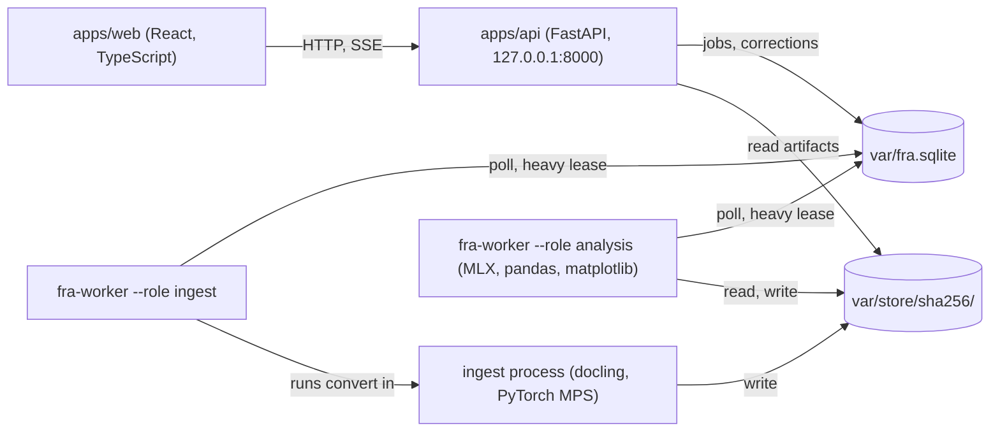

# 02. Architecture

## 2.1 Decisions

| ADR | Decision | Reason |
|-----|----------|--------|
| 0001 | Local-first, single machine, one heavy runtime at a time | 18 GB unified memory; section 01, 1.3 |
| 0002 | The model never computes. pandas produces every number; the model maps labels and writes prose citing metric ids | Small quantized models are unreliable at arithmetic; auditability |
| 0003 | A canonical taxonomy is the contract between extraction, analytics, model and UI | Company labels vary widely; metrics need stable inputs |
| 0004 | Provenance on every value: page, bbox in PDF points with top-left origin, table reference, row and column | Review, correction and trust |
| 0005 | Stage artifacts are content-addressed: `(document sha256, stage, stage version)` | docling is the slowest stage; re-runs skip finished work |
| 0006 | SQLite job table (WAL mode) instead of a message broker | A broker daemon costs unified memory for no benefit on one machine |
| 0007 | docling (PyTorch MPS) and MLX run in separate OS processes; in the development profile `convert` runs in a child process per document | The two allocators keep separate caches, and MPS memory only reliably returns when the process exits |
| 0008 | One machine for everything: the Mac is used for development, training and customer demos, with all other apps closed for training and demos. The home server and hosted inference endpoints are not used | The M3 Pro is the only GPU training path and has about 3x the memory bandwidth of the home server's DDR4-3200, so generation is faster. One runtime (MLX) for training and serving avoids a format conversion and a parity gate. Documents never leave the machine |
| 0009 | One resident base model with a small adapter per task (label normalization, narration, later Arabic and non-corporate templates). No chain of model-reviewing-model steps | An adapter costs tens of MB against the base's 4.3 GB and swaps in place without reloading weights. Mixture-of-experts models that would offer the same breadth start at 17.2 GB in 4-bit and do not fit. A review chain would multiply latency, while numeric correctness is already enforced deterministically (N1) |

## 2.2 Process topology



**Heavy lease.** Table `heavy_lease(id=1, holder, acquired_at, heartbeat_at)`.

- Acquire with `UPDATE heavy_lease SET holder=?, acquired_at=?, heartbeat_at=? WHERE id=1 AND (holder IS NULL OR heartbeat_at < ?)`,
  using a 60 s staleness cutoff. Heartbeat every 10 s.
- The ingest worker holds the lease while `convert` runs; the analysis worker holds it while
  `normalize` or `narrate` calls the model.

**Session profiles.** What stays in memory between heavy stages depends on the profile
(section 01, 1.3), set in `configs/profiles/<name>.toml`:

| Setting | `dev` | `demo` |
|---------|-------|--------|
| `ingest.process_per_document` | `true`: a child process per document, exiting after it writes, so MPS memory returns | `false`: one ingest process keeps the docling models loaded |
| `analysis.keep_model_loaded` | `false`: unload (`del` model, `mx.clear_cache()`) after 120 s idle, or at once when an ingest job waits | `true`: weights stay loaded and the lease serializes compute only |
| `memory_guard.heavy_stage_min_free_gb` | 5.0 | 3.0 |

The `training` profile requires the API and both workers to be stopped.

## 2.3 Pipeline stages

| # | Stage | Runs in | Heavy | Artifact | Behaviour |
|---|-------|---------|-------|----------|-----------|
| 1 | `locate` | ingest worker | no | `locate.json` | pypdfium2 text per page, scored on statement titles and numeric density. Pages with no text layer get a low-resolution ocrmac pass. Candidate ranges are padded by one page on each side |
| 2 | `convert` | ingest process | yes | `docling.json`, `pages/<n>.png` | docling on candidate ranges only (`page_range`), page images at `images_scale=2.0`; in the development profile the child process exits after writing |
| 3 | `structure` | ingest worker | no | `statements.raw.json`, `table_checks.json` | Cell grid, headers to periods, notes column, hierarchy, page continuation, scale and currency, subtotal checks |
| 4 | `normalize` | analysis worker | only for residual labels | `statements.json` | Lexicon lookup first; model at temperature 0 for residual labels; decisions cached by `(statement type, normalized label, parent label)` |
| 5 | `validate` | analysis worker | no | `validation.json` | Accounting identities, cross-statement ties, presence of critical items |
| 6 | `compute` | analysis worker | no | `metrics.json`, `frame.parquet` | Metric registry over a tidy frame, with policy D1 to D6 applied |
| 7 | `narrate` | analysis worker | yes | `narrative.json` | Skipped while the job is `needs_review` |
| 8 | `render` | analysis worker | no | `charts/<id>.svg`, `charts/<id>.json` | Built from the same frame as `compute` |

Each stage module exports `STAGE_VERSION`. Artifacts live at
`var/store/<sha256>/<stage>@<version>/`. Bumping a version invalidates that stage and
everything downstream of it.

**Job states.**

- Normal flow: `queued` → `running:<stage>` → `completed` | `needs_review` | `failed`.
- Critical flags from `structure`, `normalize` or `validate` set `needs_review`.
- A user correction moves the job back to `queued`, re-entering at `validate`.
- Narration re-runs only on explicit request.

## 2.4 Data contract (`packages/core`)

```python
# fra_core/schemas/statement.py
from datetime import date
from decimal import Decimal
from enum import StrEnum
from typing import Literal

from pydantic import BaseModel


class StatementType(StrEnum):
    INCOME = "income"
    COMPREHENSIVE_INCOME = "comprehensive_income"
    BALANCE = "balance"
    CASH_FLOW = "cash_flow"
    EQUITY = "equity"


class BBox(BaseModel):
    """PDF points, top-left origin (normalized with BoundingBox.to_top_left_origin)."""

    left: float
    top: float
    right: float
    bottom: float


class Provenance(BaseModel):
    page_no: int  # 1-based, as reported by docling ProvenanceItem.page_no
    bbox: BBox
    table_ref: str  # docling self_ref, e.g. "#/tables/3"
    row: int  # TableCell.start_row_offset_idx
    col: int  # TableCell.start_col_offset_idx


class Period(BaseModel):
    key: str  # "FY2024", "H1-2025", "2024-12-31"
    end_date: date
    kind: Literal["duration", "instant"]
    months: int | None  # None for instants
    restated: bool = False
    audited: bool | None = None


class Cell(BaseModel):
    period_key: str
    reported: Decimal | None  # as printed, sign applied, before scale; None for blank
    raw_text: str
    provenance: Provenance
    flags: list[str] = []


class LineItem(BaseModel):
    id: str
    raw_label: str
    canonical_id: str | None
    mapping_source: Literal["lexicon", "model", "user"] | None
    mapping_confidence: float | None
    depth: int
    is_subtotal: bool
    parent_id: str | None
    note_ref: str | None
    cells: list[Cell]


class Statement(BaseModel):
    id: str
    document_sha256: str
    type: StatementType
    entity_name: str | None
    consolidated: bool | None
    currency: str  # ISO 4217
    scale: int  # 1, 1_000, 1_000_000, 1_000_000_000
    periods: list[Period]
    line_items: list[LineItem]
    source_pages: list[int]
    language: str = "en"
    flags: list[str] = []
```

```python
# fra_core/schemas/metric.py
from typing import Literal

from pydantic import BaseModel


class MetricValue(BaseModel):
    metric_id: str  # "net_margin"
    period_key: str
    value: float | None
    unit: Literal["ratio", "currency", "days", "times", "per_share"]
    inputs: dict[str, list[str]]  # role -> line item ids
    formula_version: str
    flags: list[str] = []
```

```python
# fra_core/schemas/narrative.py
from typing import Literal

from pydantic import BaseModel


class Claim(BaseModel):
    metric_id: str
    period_key: str
    text_span: str  # exact substring of the sentence that states the value


class Sentence(BaseModel):
    text: str
    claims: list[Claim]


class NarrativeSection(BaseModel):
    heading: Literal[
        "overview", "profitability", "liquidity", "leverage", "cash_flow", "watch_items"
    ]
    sentences: list[Sentence]


class Narrative(BaseModel):
    sections: list[NarrativeSection]
    model_id: str
    adapter_id: str | None
    grounding: Literal["passed", "fallback_template"]
```

Numeric representation:

- `Decimal` in the contract, serialized as strings in JSON.
- Identity checks run on `Decimal` values in reported units, so they are exact apart from
  the printed rounding tolerated by D6.
- The broader ratio engine is planned around float64 (`reported x scale`) in pandas.
  The first pure slice, `fra_analytics.compute_margins`, instead divides signed reported
  `Decimal` values under an explicit precision-34, half-even context, then converts once to
  the existing float `MetricValue` boundary. Same-statement scale cancels; values are fractions.
  Undefined or unrepresentable results are null with explicit flags, never infinity or silent
  nonzero underflow. Zero revenue uses `undefined_zero_denominator`; the tracked negative-revenue
  policy computes with `negative_base`, with an explicit null alternative. These D1 defaults
  remain provisional pending owner sign-off. Input row IDs are statement-scoped: retain the
  source `Statement` alongside results to resolve cells and page regions. This slice propagates
  uncertainty flags and does not approve documents; production review/industry gates, identities,
  other metrics, charts and the full Task 5 golden-pipeline acceptance remain deferred.
- Display precision lives in one place, `fra_analytics.formatting`, shared by the UI
  payload and the grounding checker.

## 2.5 Canonical taxonomy v1

File: `fra_core/taxonomy/canonical_items.yaml`. Items marked `*` are critical: if one is
missing or its mapping confidence falls below threshold, the job goes to `needs_review`.
Every item records `statement`, `natural_sign` (`+` or `-` as usually presented) and an
optional `parent`.

- **Income:** `revenue*`, `cost_of_revenue`, `gross_profit`, `selling_general_admin`,
  `research_development`, `depreciation_amortization`, `other_operating_income_expense`,
  `operating_income*`, `finance_income`, `finance_costs`, `share_of_associates_profit`,
  `profit_before_tax`, `income_tax_expense`, `net_income*`, `net_income_attributable_parent*`,
  `net_income_attributable_nci`, `eps_basic`, `eps_diluted`
- **Balance:** `cash_and_equivalents*`, `short_term_investments`, `trade_receivables`,
  `inventories`, `other_current_assets`, `total_current_assets*`, `ppe_net`,
  `right_of_use_assets`, `goodwill`, `intangible_assets`, `investments_in_associates`,
  `other_non_current_assets`, `total_non_current_assets`, `total_assets*`, `trade_payables`,
  `short_term_borrowings`, `current_portion_long_term_debt`, `lease_liabilities_current`,
  `other_current_liabilities`, `total_current_liabilities*`, `long_term_borrowings`,
  `lease_liabilities_non_current`, `other_non_current_liabilities`,
  `total_non_current_liabilities`, `total_liabilities*`, `share_capital`, `retained_earnings`,
  `other_reserves`, `equity_attributable_parent*`, `non_controlling_interests`,
  `total_equity*`, `total_liabilities_and_equity*`
- **Cash flow:** `cash_from_operations*`, `capital_expenditure`, `cash_from_investing*`,
  `dividends_paid`, `cash_from_financing*`, `fx_effect_on_cash`, `net_change_in_cash*`,
  `cash_end_of_period`

## 2.6 Metric registry v1

`avg(x)` is the mean of the opening and closing balance (D2). `days` follows D4. Growth
metrics compare periods of equal length only. Flows use magnitudes where `natural_sign` is
negative (`capital_expenditure`, `finance_costs`, `dividends_paid`). A sign that contradicts
`natural_sign` adds flag `sign_unexpected`.

| Metric id | Formula | Unit | Polarity |
|-----------|---------|------|----------|
| `gross_margin` | gross_profit / revenue | ratio | higher |
| `operating_margin` | operating_income / revenue | ratio | higher |
| `net_margin` | net_income / revenue | ratio | higher |
| `ebitda` | operating_income + depreciation_amortization (cash-flow add-back when absent from income) | currency | higher |
| `roa` | net_income / avg(total_assets) | ratio | higher |
| `roe` | net_income_attributable_parent / avg(equity_attributable_parent) | ratio | higher |
| `current_ratio` | total_current_assets / total_current_liabilities | times | higher |
| `quick_ratio` | (cash_and_equivalents + short_term_investments + trade_receivables) / total_current_liabilities | times | higher |
| `cash_ratio` | cash_and_equivalents / total_current_liabilities | times | higher |
| `total_debt` | short_term_borrowings + current_portion_long_term_debt + long_term_borrowings (+ lease liabilities per D3) | currency | lower |
| `debt_to_equity` | total_debt / total_equity | times | lower |
| `net_debt` | total_debt - cash_and_equivalents - short_term_investments | currency | lower |
| `net_debt_to_ebitda` | net_debt / ebitda | times | lower |
| `interest_coverage` | operating_income / abs(finance_costs) | times | higher |
| `asset_turnover` | revenue / avg(total_assets) | times | higher |
| `dso` | avg(trade_receivables) / revenue x days | days | lower |
| `dio` | avg(inventories) / cost_of_revenue x days | days | lower |
| `dpo` | avg(trade_payables) / cost_of_revenue x days | days | neutral |
| `cash_conversion_cycle` | dso + dio - dpo | days | lower |
| `free_cash_flow` | cash_from_operations - abs(capital_expenditure) | currency | higher |
| `fcf_margin` | free_cash_flow / revenue | ratio | higher |
| `cash_conversion` | cash_from_operations / net_income | times | higher |
| `revenue_growth`, `net_income_growth`, `eps_growth` | x_t / x_(t-1) - 1 | ratio | higher |
| `revenue_cagr` | (x_last / x_first)^(1 / years) - 1; needs 3 or more annual periods and positive endpoints | ratio | higher |

Registry entry shape:

```python
# fra_analytics/metrics/registry.py
from collections.abc import Callable
from dataclasses import dataclass
from typing import Literal

import pandas as pd


@dataclass(frozen=True)
class MetricSpec:
    id: str
    inputs: tuple[str, ...]  # canonical ids
    unit: Literal["ratio", "currency", "days", "times", "per_share"]
    polarity: Literal["higher", "lower", "neutral"]
    min_periods: int  # 2 for averages and growth, 3 for CAGR
    formula_version: str
    fn: Callable[[pd.DataFrame, "Policy"], pd.Series]  # indexed by period_key
```

## 2.7 Grounding checker (`fra_model.grounding`)

1. **Parse.** Parse model output into `Narrative`. On a validation error, make one repair
   call with the error text; if that also fails, use `fra_model.templates`.
2. **Extract numeric mentions** from each sentence. Handled forms: `12.5%`, `(12.5)%`,
   `1.8x`, `SAR 1.2bn`, `$450m`, `1,234`, `-3.4`, `−3.4` (U+2212), and `12.5 percentage points`.
   Four-digit years are ignored when they match a period key in the payload.
3. **Match claims.** Every mention must fall inside exactly one `claim.text_span`. That
   claim's `(metric_id, period_key)` must exist in `metrics.json`, and the written value must
   equal the metric formatted at the precision written (for example, "12.5%" matches 0.12496).
4. **Check direction words.** In a sentence with a growth or change claim, direction words
   (rose, grew, increased, fell, declined, narrowed, widened) must agree with the sign of the
   change. Quality words (improved, deteriorated, strengthened, weakened) must also agree with
   the metric's polarity.
5. **Check the period** (D18). The period a sentence names must be its claim's `period_key`,
   and a change claim must compare two periods of the same length in months, so an interim
   figure is never set against an annual one or annualized unless the metric itself is
   annualized (D4, D5). A mismatch is an ungrounded claim.
6. **On failure,** regenerate once with the failing spans listed. If that fails too, set
   `grounding="fallback_template"` and emit deterministic sentences.
7. **Gate G-N1:** zero ungrounded mentions ship, measured on every golden document.

## 2.8 API surface (`apps/api`)

| Method and path | Purpose |
|-----------------|---------|
| `POST /documents` | Multipart upload. PDF magic bytes, 50 MB limit, 400-page limit, sha256 dedupe. Returns `Document` |
| `GET /documents/{id}` | Metadata, detected language, text-layer coverage |
| `GET /documents/{id}/pages/{page_no}.png` | Rendered page for the source viewer |
| `POST /documents/{id}/analyses` | Enqueue a job. Returns `Job` |
| `GET /jobs/{id}` | Status, current stage, flags |
| `GET /jobs/{id}/events` | Server-sent events for stage transitions |
| `GET /analyses/{id}` | Statements, validation, metrics, narrative |
| `GET /analyses/{id}/charts/{chart_id}.svg` | matplotlib output |
| `GET /analyses/{id}/charts/{chart_id}.json` | Chart series for client-side interaction |
| `POST /analyses/{id}/corrections` | Value or mapping correction. Re-enters at `validate`, returns recomputed metrics, stores a labeled example |
| `GET /analyses/{id}/export.xlsx` | Statements and metrics workbook |
| `GET /health` | Free memory, lease holder, model loaded, disk free |

The API binds to 127.0.0.1 and never imports docling, torch or mlx (checked by T7).
